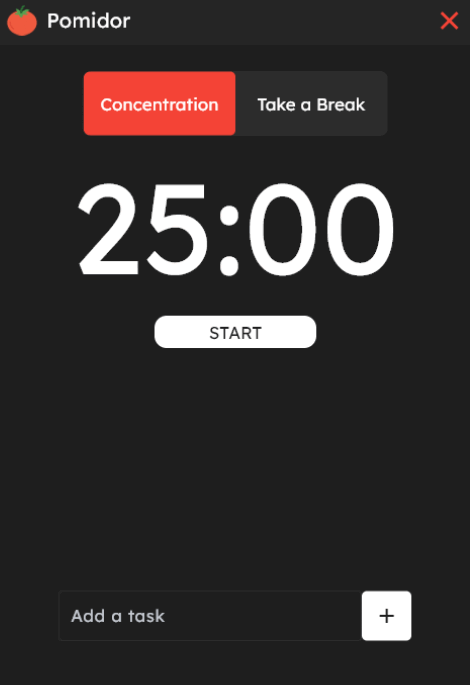

# Pomidor🍅

**Pomidor** is simple and effective Pomodoro Timer designed to stay productive, focused and manage your time. 


## Features📦

- ⏱ Classic timer: 25 minutes of work, 5 minutes of break
- 📝 Task list: Create up to 4 tasks you want to work on, edit or delete them
- 🌙 Design: Minimalistic dark-themed design to stay focused

## GUI🎨

Choose among **concentration** and **pause**:



Create, edit or delete **tasks**:


## Tech stack⚙️
   

I used self-taught skills in UI/UX, development and version control

## Installation and usage🚀
```
git clone https://github.com/alxww55/pomidor.git
cd pomidor
pip install -r requirements.txt
cd src
python main.py
```
## What is Pomodoro?⏳
The **Pomodoro Technique** is a time management method developed by Francesco Cirillo. It involves working in focused 25-minute intervals (called Pomodoros), followed by short breaks.

## Planned Features💡
- 📊 Daily/weekly stats